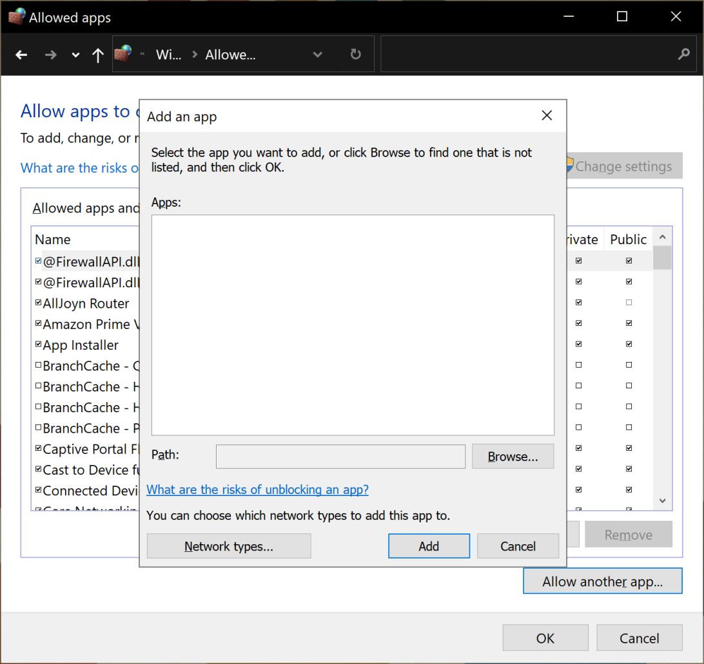
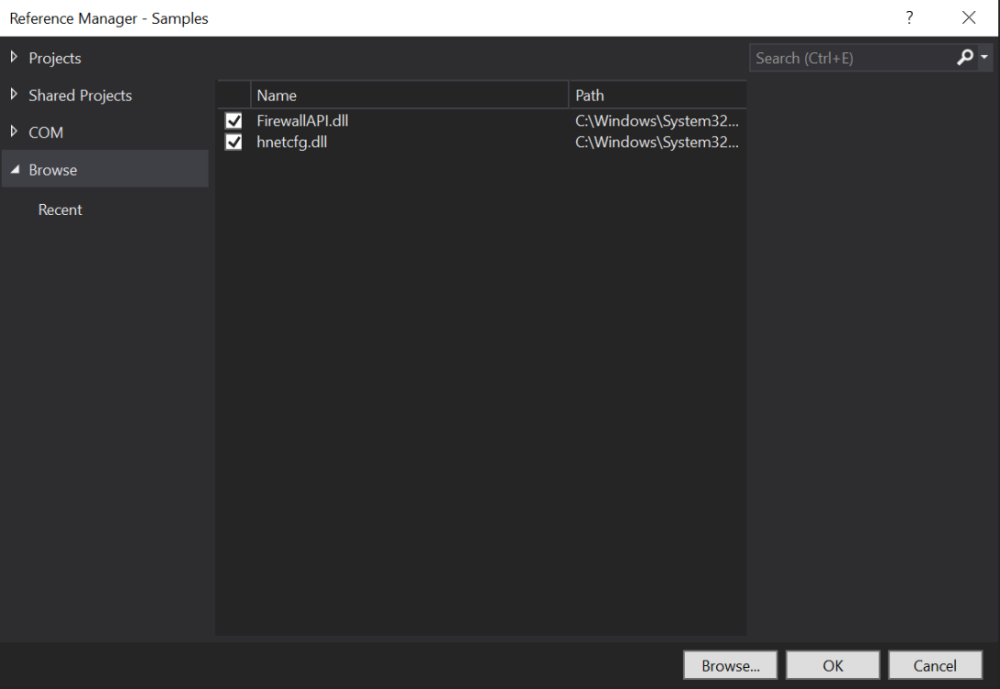
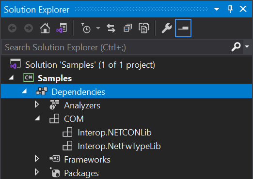

If you're running Windows, then in order for your server to be accessible from outside of your local machine you'll need to open the Windows Firewall for your application. You can do this either from the Windows Defender UI or using code in your application. In both case, you will need elevated privledges (admin account) to make changes to the firewall.

## Open Windows Firewall Via UI

These instructions are for Windows 10. For earlier versions of Windows, consult the documentation for specific steps.

1. Open the _Windows Defender Firewall_ Control Panel module by running `control firewall.cpl` from the command line.

2. On the left hand navigation, click on **Allow an app or feature through Windows Defender Firewall** to open the _Allowed Apps_ dialog.


3. Click on the **Change settings** button to allow the settings to be changed. If you are not logged in to an admin account, you will be prompted for admin credentials.

4. Click on **Allow another app...** button to open the _Add an app_ dialog. Click the **Browse** button to browse to your applications executable file, and select it.



5. Click on the **Add** button to add allow the application access through the firewall.

## Open Windows Firewall Via Code

This requires accessing some COM references, which AFAIK can't be done in a class library. But you can easily add it to your application using the example below.

### Add The COM References

You will first want to add two COM references to your application, `hnetcfg.dll` and `FirewallAPI.dll`. Both DLLs are located in `C:\Windows\System32` directory.

1. In Visual Studio, right click on your project dependencies and select **Add COM Reference**.

1. Click the **Browse** button in the lower right hand corner of the dialog box.

1. Navigate to `C:\Windows\System32` and select `hnetcfg.dll`, then clicke the **Add** button.

1. Repeat steps 2 and 3 for `FirewallAPI.dll`.

1. Click **OK** in the dialog box to return to Visual Studio.



The COM references should now be added to your project.



### Create a FirewallPolicy Class

Next we'll create a simple class that will create our firewall rule and policy. We'll include methods with matching delegate signatures for our server starting and stopping event handlers to add and remove the rule from the policy.

```csharp title="FirewallPolicy.cs"
using System;
using Grapevine;
using NetFwTypeLib;

namespace Samples
{
    public class FirewallPolicy
    {
        private INetFwRule _rule;
        private INetFwPolicy2 _policy;

        public string AppExecutablePath { get; set; }

        public string Description { get; set; }

        public string Name { get; set; }

        public INetFwPolicy2 Policy => _policy;

        public INetFwRule Rule => _rule;

        private INetFwRule GenerateRule()
        {
            if (_policy == null)
                _policy = (INetFwPolicy2)Activator.CreateInstance(Type.GetTypeFromProgID("HNetCfg.FwPolicy2"));

            _rule = (INetFwRule)Activator.CreateInstance(Type.GetTypeFromProgID("HNetCfg.FWRule"));
            _rule.ApplicationName = AppExecutablePath;
            _rule.Action = NET_FW_ACTION_.NET_FW_ACTION_ALLOW;
            _rule.Description = Description;
            _rule.Enabled = true;
            _rule.InterfaceTypes = "All";
            _rule.Name = Name;

            return _rule;
        }

        public void AddFirewallPolicy(IRestServer server)
        {
            if (_rule != null) return;
            _policy.Rules.Add(GenerateRule());
        }

        public void RemoveFirewallPolicy(IRestServer server)
        {
            if (_rule == null) return;
            _policy.Rules.Remove(_rule.Name);
            _rule = null;
        }
    }
}
```

### Add Middleware Extension Method

You can add a middleware extension to handle adding and removing your policy.

In the example here, I use the `IRestServer.AfterStarting` handler to add the policy because I don't want the firewall to be open to receiving messages until the server has finished starting up.

Likewise, I use the `IRestServer.BeforeStopping` handler to remove the policy because I want to ensure no more requests are coming in before I begin shutting down the server.

```csharp title="FirewallPolicyExtensions.cs"
using Grapevine;

namespace Samples
{
    public static class FirewallPolicyExtensions
    {
        public static IRestServer UseFirewallPolicy(this IRestServer server, FirewallPolicy policy)
        {
            server.AfterStarting += policy.AddFirewallPolicy;
            server.BeforeStopping += policy.RemoveFirewallPolicy;
            return server;
        }
    }
}
```

### Using Your Middleware Extension

You can now add your firewall policy to the server - make sure to do this before starting the server.

```csharp
var firewallPolicy = new FirewallPolicy
{
    AppExecutablePath = "", //Application Executable Path
    Description = "Description of your firewall rule",
    Name = "" // Your Application Name
};

server.UseFirewallPolicy(firewallPolicy);
```